# Od instalacji LinuxCNC 2.9.8 Debian 13 przez EtherCat Master do pierwszego ruchu silnika         
        
      
 
<details>
<summary id=1. Instalacja linux >1. Instalacja linuxcnc</summary>  

   
1.1 Instalacja dotyczy linux 2.9.8 Debian 13 trixie    
Pobierz obraz:    
https://www.linuxcnc.org/iso/linuxcnc_2.9.8-amd64.hybrid.iso    
Zamontuj iso na pedrive np. przez program Rufus    
      
1.2 Jeśli linux będzie jako drugi system możesz wcześniej w Windows stworzyć miejsce nieprzydzielone na dysku:    
- Naciśnij Win + X i wybierz Zarządzanie dyskami.    
- Zmniejszenie partycji (jeśli chcesz zachować dane)    
- W oknie Zarządzanie dyskami znajdź partycję, którą chcesz zmniejszyć.    
- Kliknij ją prawym przyciskiem myszy i wybierz Zmniejsz wolumin.    
- Wpisz, o ile MB chcesz zmniejszyć partycję    
– tyle miejsca stanie się nieprzydzielone.    
Kliknij Zmniejsz.    
        
1.3 Zmień w bios botowanie jako piersze ustaw pendrive.    
Po bottowaniu pendrive wybierz install linuxcnc    
Wybór dysku ręcznie    
Wybór partycji: potrzebna jest jedna partycja systemowa EFI, partycja swap 4-16 GB, oraz partycja ext 4 z punknem montowania /    
użyj jako: partycja systemowa EFI                          
Uzyj jako: partycja swap 4-16 GB      
Uzyj jako: Partycja ext 4 z punknem montowania    
*jeśli to bios legecy nie UEFI to nie tworzymy partycji EFI    
*jeśli partycja efi istnieje wybierz użyj jako partycji systemowej i bez formatowania.    
*w partycji EFI musi istnieć wpis Debian aby system sie zbotował z dysku    
     
1.4 jeśli GRUB nie będzie chciał się zainstalować wybierz zakończ bez programu startowego    
Jednak w tej sytłacji należy zostawić pendrive żeby linux się ponownie zbotował.    
I wybrać na górze: Live linuxcnc    
Aby doinstalować GRUB przez internet
    
1.5 W live linux    
połącz się z inernetem w toolbar. 
     
      
     

    
1.6 Montowanie i operowanie na partycjach systemowych aby wprowadzić wpis do EFI    
sprawdz partycje:     
lsblk -f    
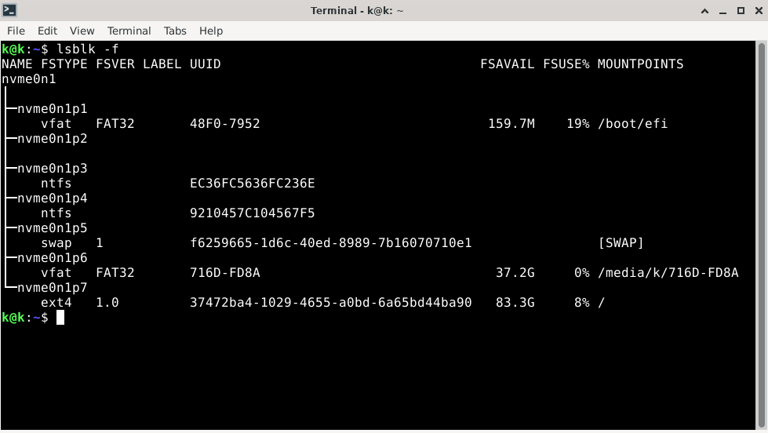        
  
  
Zamontuj partycję efi oraz /ext4 po ich nazwie w tym przypadku:     
```sudo mkdir -p /mnt```       
```sudo mount /dev/nvme0n1p7 /mnt/```           PARTYCJA /EXT4     
```sudo mkdir -p /mnt/boot/efi```          
```sudo mount /dev/nvme0n1p1 /mnt/boot/efi```   partycja EFI     
     
 
          
Podmontuj katalogi systemowe po kolei:      
```sudo mount --bind /dev  /mnt/dev```      
```sudo mount --bind /proc /mnt/proc```      
```sudo mount --bind /sys  /mnt/sys```        
```sudo mount --bind /run  /mnt/run```      
    
 Bind internet do partycji:      
```sudo mkdir -p /mnt/etc```      
```sudo mount --bind /etc/resolv.conf /mnt/etc/resolv.conf```       
sprawdz internet:      
```ping -c 3 deb.debian.org```        
     
teraz instalacja GRUB:        
wejdź do Debiana (ch root)     
```sudo chroot /mnt```    
powinno wyświetlić się: Prompt powinien być: root@debian:/#    
  
Doinstaluj GRUB     
```apt update```     
```apt install grub-efi-amd64 efibootmgr```     
   
Zainstaluj GRUB do EFI:    
```grub-install --target=x86_64-efi --efi-directory=/boot/efi --bootloader-id=Debian```   
   
opcjonalnie Wygeneruj menu   
```update-grub```   
Wyjdź i posprzątaj    
```exit```   
```sudo umount -R /mnt```    
```reboot```    
     
teraz wpis w EFI(/boot/efi/EFI/Debian/) już jest stworzony linux bedzie botował się normalnie.      
Koniec instalacji wyjmij pendrive, przy starcie możesz włączyć boot menager klikając np F7 zależnie od biosu. 

*Jeśli masz bios legecy komendy wyglądają następująco:
Zamontuj partycję  /ext4 po nazwie w tym przypadku:  
```sudo mkdir -p /mnt```
```sudo mount /dev/nvme0n1p7 /mnt```

Podmontuj katalogi systemowe po kolei:    
```sudo mount --bind /dev  /mnt/dev```    
```sudo mount --bind /proc /mnt/proc```    
```sudo mount --bind /sys  /mnt/sys```    
```sudo mount --bind /run  /mnt/run```
      
Bind internetu do partycji:     
```sudo mkdir -p /mnt/etc```    
```sudo mount --bind /etc/resolv.conf /mnt/etc/resolv.conf```       
    
  
    
wejdź do Debiana (ch root)     
```sudo chroot /mnt```    
Zainstaluj GRUB do MBR całego dysku wpisując za nvme0n1 własną nazwę dysku        
```apt update && apt install -y grub-pc && grub-install /dev/nvme0n1 && update-grub```     
    
    
opcjonalnie Wygeneruj menu    
```update-grub```    
Wyjdź i posprzątaj               
```exit```    
```sudo umount -R /mnt```     
```reboot```     
     
</details>    
       
---
      
<details>
<summary id=2. Przygotowanie sytemu pod Ethercat >2. Przygotowanie sytemu pod Ethercat</summary>  
     
2.1 Uruchom system     
2.2 ustawienie karty sieciowej    
kliknij na ustawienia karty w prawym górnym rogu.    
zmień 2 piersze strony reszte wyłącz
     
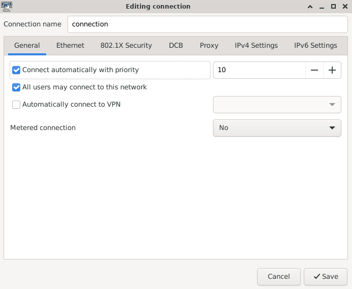  
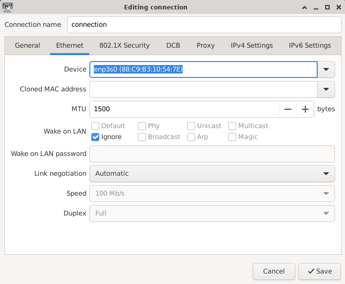 
    
2.3 Wyłączenie NETWORKMENAGER dla karty sieciowej aby EtherCat miał ją na wyłączność.      
znajdz nazwę karty:           
```ip link```   
     
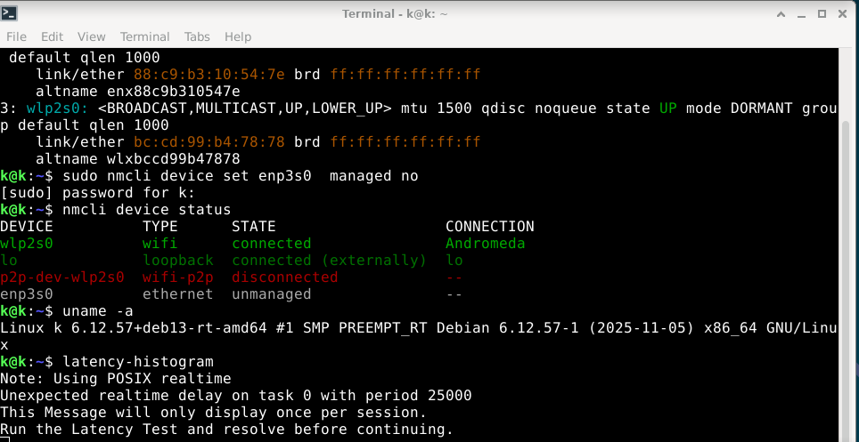 
    
wyłącz Menagera, pod eth1 podstaw własną nazwę:     
```sudo nmcli device set eth1 managed no```    
sprawdz czy została unmenaged:        
```nmcli device status```     
          
2.4 Aktualizacja systemu      
```sudo apt update```     
```sudo apt upgrade```   
Continue? [Y/n] y    
               
2.5 instalacja Git    
```sudo apt update```    
```sudo apt install git```    
```git --version```    
         
</details>

---
   
<details>
<summary id=3. Instalacja EtherCat Master >3. Instalacja EtherCat Master</summary>  
     
   Przygotowanie sytemu pod Ethercat    
        
```sudo apt update```     
```sudo apt install  linuxcnc-ethercat```     
    
3.1 sprawdz adres MAC dla kart sieciowej    
```ip a```    
 Potem wypełnij    
 ```sudo geany /etc/ethercat.conf```     
     
 MASTER0_DEVICE="................"    
 DEVICE_MODULES="generic"    
i zapisz i zamknij.

       
3.2 Pierwsze włączenie Ethercat po kolei:      
```sudo systemctl enable ethercat.service```      
```sudo systemctl start ethercat.service```     
```sudo systemctl status ethercat.service```     
```sudo chmod 666 /dev/EtherCAT0```     
   
3.3 Zgoda dla Ethercat master przy starcie systemu      
```sudo geany /etc/udev/rules.d/99-ethercat.rules```      
wklej:      
```KERNEL=="EtherCAT[0-9]", MODE="0777"```     
Zapisz i zamknij.    
           
Potem wpisz         
```sudo udevadm control --reload-rules```      
Restart komputera        
    
</details>

---
 
<details>
       
<summary id=4. Podłączanie Servodriverów>4. Podłączanie Servodriverów</summary>     
        

    
na tym etapie możesz podłączyć EK1100 i servodrivery z servami do prądu, podączyć do karty sieciowej:       
 zresetować błędny na servodriverach jeśli występują, zgodnie z instrukcją obsługi.    
 Potem sprawdzić:    
```sudo ethercat master```    
```sudo ethercat slaves```        
```uname -a```    
```latency-histogram```     
 
 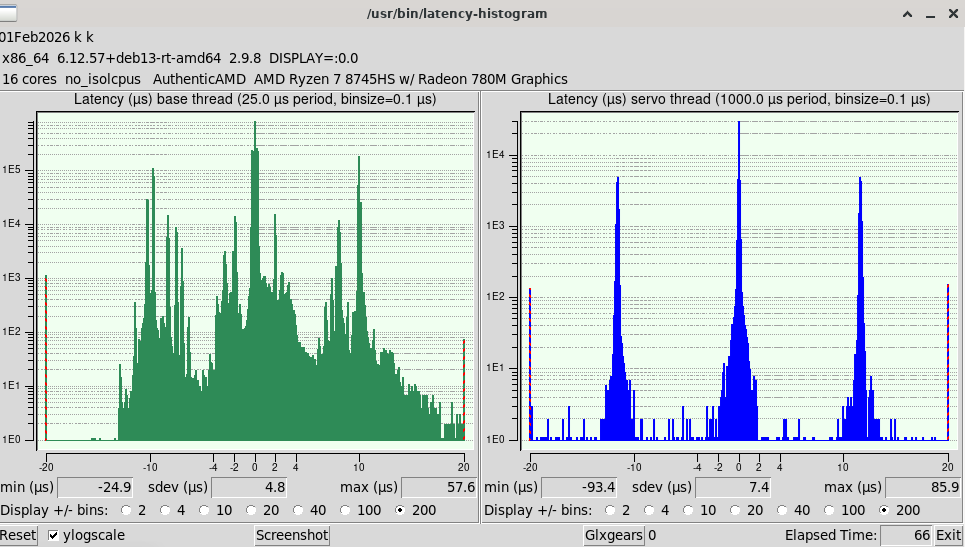
      
 po testach     
 Jeśli serodvivery są w stanie PREOP, możesz je przygasić:     
 ```sudo ethercat states init```    
 i wyłączyć zasilanie     
       
</details>  

---

<details>     
     
<summary id="5. Podpinanie karty pod Ethercat master">5. Podpinanie karty pod Ethercat master</summary>    
     
Kartę sieciową można podpiąć pod Ethercat master Jeśli zostanie przez niego rozpoznana.     
wspierane karty to głównie intel ze sterownikiem igb igc 1000 1000e.     
Powoduje to większą kompatybilność z realtime i prace karty tylko pod skrzydłem ethercat.     
     
sprawdzanie rodzaju sterownika karty sieciowej w Kernel.     
```sudo apt update```     
```sudo apt install ethtool```     
znajdz nazwę swojej karty     
```ip a```     

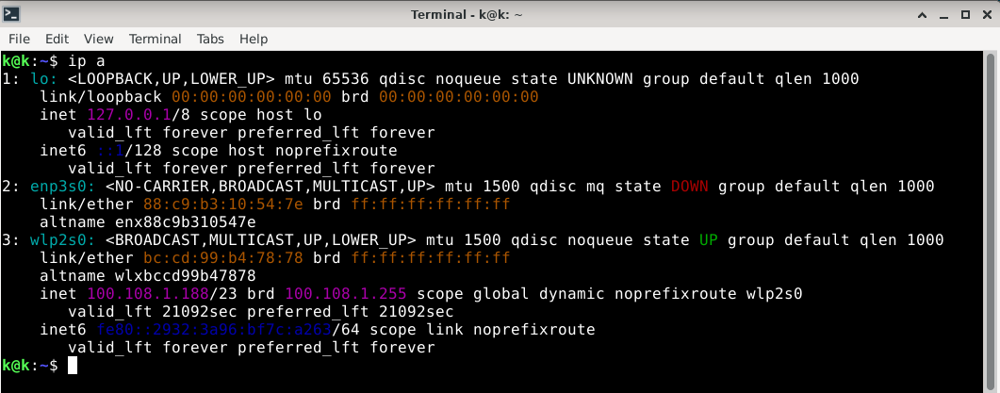   
      
i podmień nazwę za enp3s0 na własną     
```sudo ethtool -i enp3s0```       
model karty     
```lspci -nn | grep -i ethernet```  
      
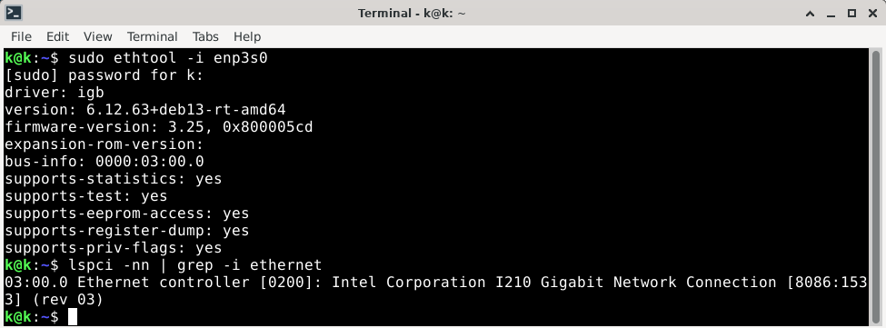          
       
jeśli sterownik karty ma nazwę igb igc 1000 1000e i kilka innych wymienionych w ethercat.conf spróbujemy ją podpiąć pod mastera zamiast używać trybu generic.   
      
```sudo geany /etc/ethercat.conf```

 w tym przypadku zamiana generic na: 
 
DEVICE_MODULES="igb"    

zapisz i zamknij      
     
```sudo systemctl stop ethercat```     
```sudo systemctl start ethercat```    
     
Sprawdzamy czy karta jest Native/attached     
     
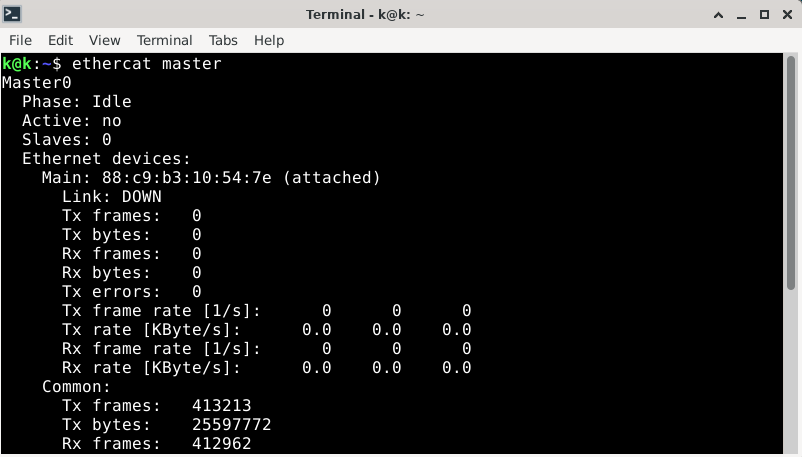         
     
jeśli nie wróć do ethercat.conf i zapisz spowrotem generic.       


 </details>

---

<details> 

<summary id=6. Instalacja Cia402.comp>6. Instalacja Cia402.comp</summary>     
        
```mkdir -p ~/dev```      
```cd ~/dev```     
```git clone https://github.com/dbraun1981/hal-cia402```     
```cd hal-cia402```    
```sudo halcompile --install cia402.comp``` 


 </details>

---

<details>     
   
<summary  id=7. instalacja custom homing>7. instalacja custom homing</summary>    


Zainstaluj żródła linuxcnc-dev      
```git clone https://github.com/LinuxCNC/linuxcnc.git linuxcnc-dev```      
potem skopiuj pliki Homing      
```cd ~/dev```      
```git clone https://github.com/rodw-au/cia402_homecomp```      
     
5.1 teraz trzeba podmienić jedną linijkę.     
Przejdz się po folderach i znajdz ten plik:    
/home/..../linuxcnc-dev/src/emc/motion/homing.c i skopiuj jego dokładną ścieżkę     
     
       
potem wejdz do folderu /home/dev/cia402_homecomp,
     
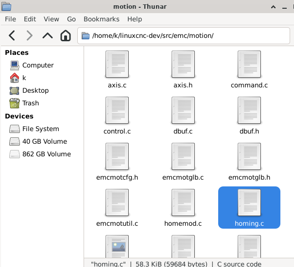    
     
otwórz plik cia402_homecomp.comp     
      
znajdz tą linijkę i podmień na własną ścieżkę      
#define HOMING_BASE home/..../linuxcnc-dev/src/emc/motion/homing.c     
i zapisz     
        
otwórz nowy terminal i wpisz:     
```cd ~/dev/cia402_homecomp```     
       
```sudo halcompile --install cia402_homecomp.comp```     
     
W puźniejszym etapie upewnij się czy istnieje taki wpis w pliku INI     
[EMCMOT]      
HOMEMOD = cia402_homecomp      
     
Koniec     
Na tym etapie wszystkie niezbędne komponenty zostały zainstalowane     

</details>

---
    
<details>     
     
<summary id=8. Uruchamianie Linuxcnc guii>8. Uruchamianie Linuxcnc gui</summary>     
           
wpisz w terminal:    
```linuxcnc```     
otwórz symulację czyli SIM np. Axis    
to stworzy foldery gdzie będziemy kopiować configurację.    
zamknij    
      
Stwórz własną konfigurację poprzez generatory lub skopuj gotową dla serw lichuan lc-e    
np. z mojego git hub    
https://github.com/szolkaa/Automatic-linuxcnc-config-generators-for-ethercat    
wejdz do folderu linuxcnc/config/    
wklej tam cały folder z konfiguracją zawierający pliki hal, ini, xml.    
      
Przed pierszym uruchomieniem linuxcnc można sprawdzić czy segmenty pamięci są czyste.
aby uniknąć takich błędów: 
rtapi_shmem_new failed due to shmget(key=0xacb572c7): Invalid argument  
lcec_conf: ERROR: couldn't allocate user/RT shared memory  
      
```ipcs -m```      
jeśli któryś ma status locked usuń go Wpisując( numer odpowadający słupkowi shmid):      
```ipcrm -m 32812```
       
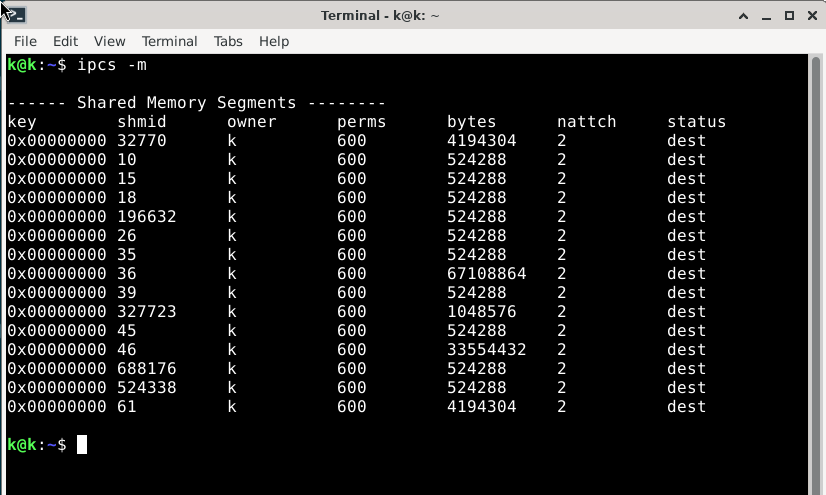     
.   
.     
.  ***Zresetuj Komputer***  
. ...........................................................................................  
.     
.     
.    
.         
Dobra można włączać:    
```linuxcnc```    
wybierz swój config...    
      
Po włączeniu programu można podłączyć kabel ethernet i włączyć zasilanie dla serw.    
      
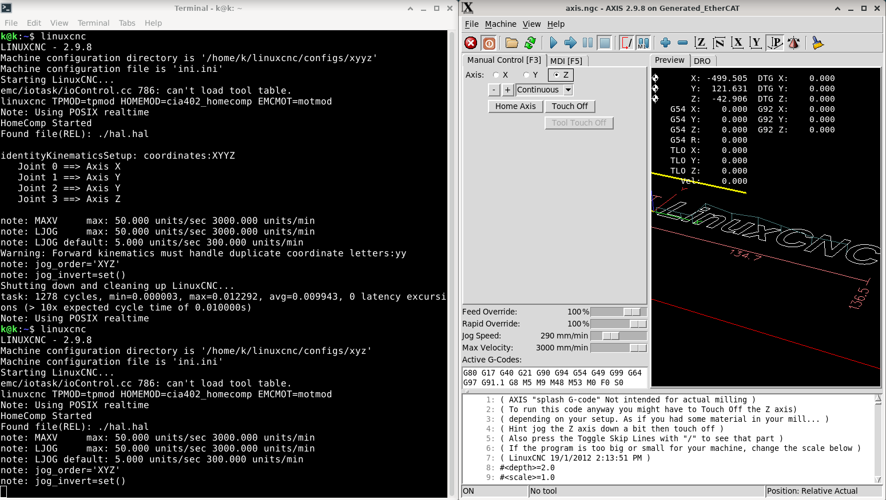       
    

----------------------
    
</details>
 

***


